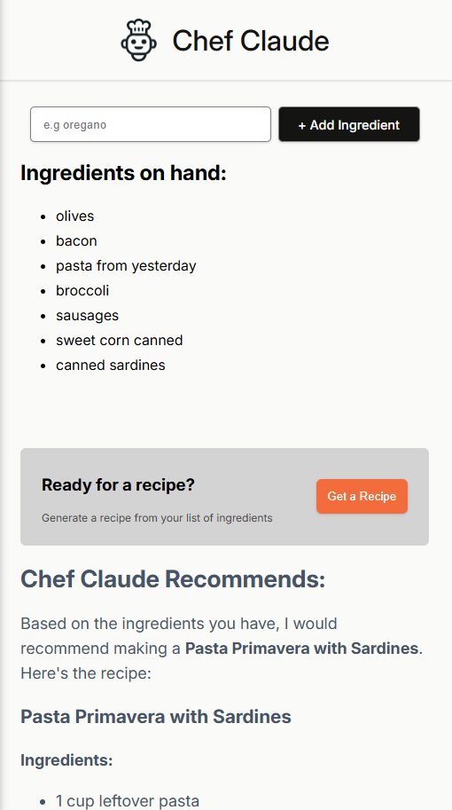

Course project.
interactive React webapp that uses anthropic AI API ro generate a recipe from a list of ingredients inputted by the user.

Learned:

    1. Event Listeners
    2. State
    3. Conditional rendering
    4. Forms
    5. State Management Strategies

Basic improvements that can be added:
    - ability remove an ingredient individually from the list
    - clear all ingredients list without having to refresh page